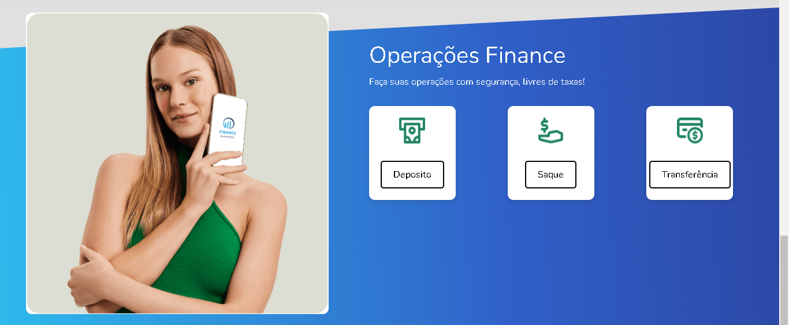
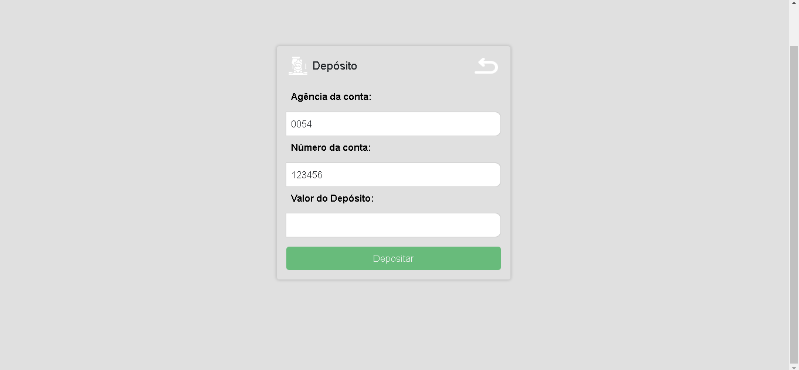
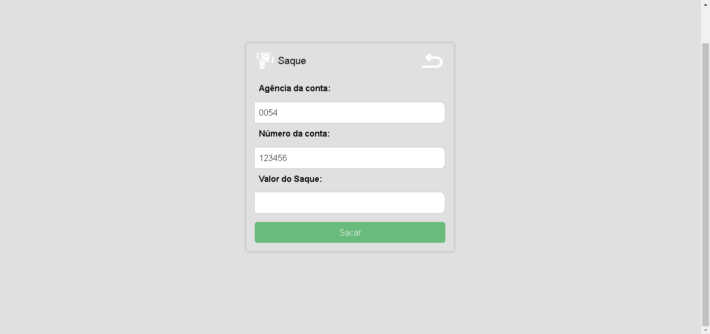
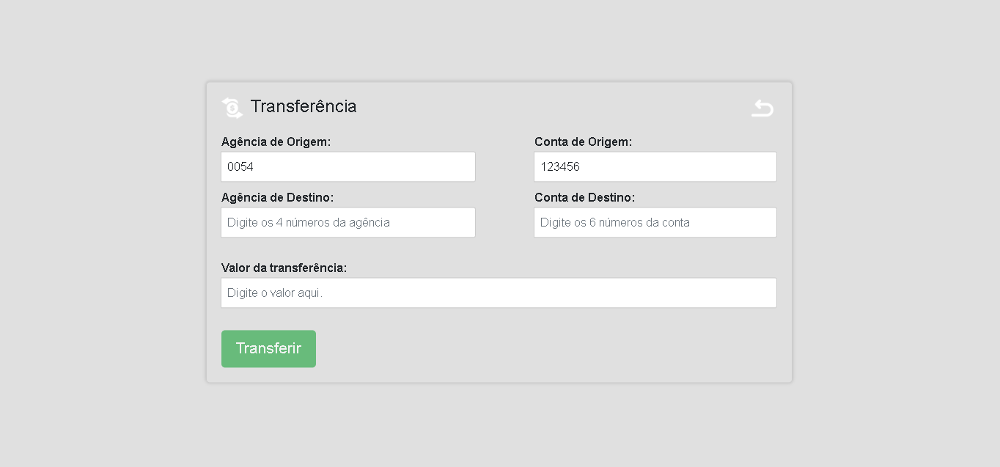
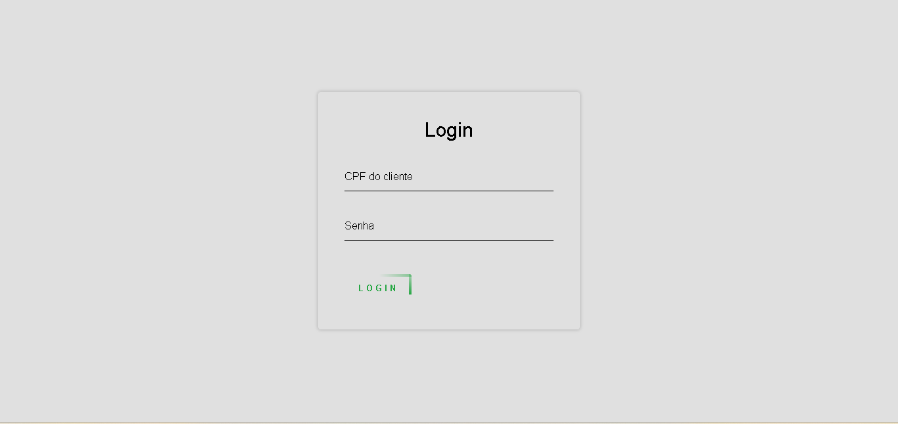

# Finance Business

> Sistema Bancário desenvolvido utilizando Spring e Angular.

O sistema Finance Business está em andamento, sendo constantemente atualizado com modificações na estrutura do projeto e a finalização do backend, desenvolvido em Java com o uso do framework Spring.

## Preview
Atualmente apenas o front-end foi feito o deploy na nuvem, então não é possível acessar todas as funções da aplicação.
 `https://finance-business-4xev-rgc2ilrw7-ruanpontes.vercel.app/ `

## Sobre o Projeto

A finalidade deste projeto é aplicar os conhecimentos adquiridos em diversos cursos que já concluí ou estou prestes a concluir, aprimorando minhas habilidades de programação.

## Funcionalidades (ou Funcionalidades Futuras)

O projeto consiste em uma API desenvolvida em Java com Spring, que realiza as requisições ao banco de dados, e um frontend desenvolvido em Angular. Ao finalizar o projeto, as seguintes funcionalidades estarão disponíveis:

- 🔄 **Em Andamento:** Cadastro de Clientes e Contas.
- 🔄 **Em Andamento:** Visualização de Extrato.
- 🔄 **Em Andamento:** Reponsividade.
- ✅ **Completo:** Login e Logout.
- ✅ **Completo:** Realização de Transações:
  - Saque
  - Depósito
  - Transferência

## Backend 🚀

- Java 11
- Spring Boot
- Spring Data JPA
- Hibernate
- MySQL
- Maven
- Lombok
- Swagger

## Frontend 🚀

- Angular
- TypeScript
- RxJS
- Bootstrap
- HTML5
- CSS3

### Como Rodar o Projeto
---
Siga as instruções abaixo para configurar e executar o sistema Finance Business em sua máquina local.

### IDEs

- [Visual Studio Code (VSCode)](https://code.visualstudio.com/)
- [IntelliJ IDEA Ultimate](https://www.jetbrains.com/ide)

## Configuração do Docker

Para rodar a imagem Docker do projeto, abra o CMD e siga os passos abaixo:

1.Primeiro, copie a imagem do Docker Hub com o seguinte comando:

- docker pull ruan0101/apenas-teste:v1.0

2.Em seguida, execute a imagem. e rode os seguintes comandos:

- Este comando irá listar quais imagens estão rodando. O objetivo é verificar a porta (a porta deve estar vazia).
  - docker ps 

- Comando para parar a imamge.
  - docker stop (ID da imagem)

- Este comando define a porta como 8080 e inicia a imagem novamente.
  - docker run -p 80:8080 ruan0101/apenas-teste:v1.0

A imagem estará em execução em  `http://localhost/treinamento/swagger-ui.html#/`.

## Configuração do Frontend

1. Navegue até o diretório do projeto frontend:
2. Instale as dependências do Angular: (npm i)
3. Inicie o servidor de desenvolvimento do Angular: (npm start)

O frontend estará em execução em `http://localhost:4200`.

## ⚠️ Este Projeto Está em Andamento ⚠️
Lembre-se de que este projeto está em andamento e pode estar sujeito a atualizações frequentes. Certifique-se de consultar o README para obter informações atualizadas sobre como executar o projeto.
